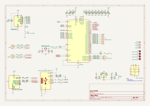

<h1>🐤 piko </h1>

  
  
  
  

    
  

CMSIS DAP Probe

### 🧺 Schematic

## 🌳 Log 
- 12 September 2025, ⏰ 19:17. success to flash [yapicoprobe-0124-pico-9aff542.uf2](https://github.com/rgrr/yapicoprobe/releases/tag/v1.24) firmware
  * to upload firmware connect usb c to pc while press reset button, there will new usb mass device detected, copy `uf2` file into that rp2040 usb mass device, and chip will be flashed.
- 12 September 2025, ⏰ 19:49, 🐛 BUG 1, remove 100 ohm resistor between SWDIO, SWCLK and pinhead connector, adding 100 ohm resistor make probing not work.

## Reference

- make new project Piko, picoprobe based on https://github.com/ErichStyger/mcuoneclipse/tree/master/KiCAD/Projects/PicoLink
- wagiminator ch552 daplink https://github.com/wagiminator/CH552-DAPLink
- yapicoprobe https://github.com/rgrr/yapicoprobe/blob/master/doc/hardware.adoc
- mcu on eclipse picolink https://mcuoneclipse.com/2023/04/08/open-source-picolink-raspberry-pi-rp2040-cmsis-dap-debug-probe/

