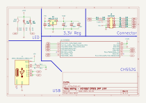

<h1> 🐍 Weling </h1>

  
  
  
  

     
  

CMSIS DAP Probe With CH552G

### 🧺 Schematic

## 🌳 Log

- 1 Oktober 2025, ⏰ 19:37. Finish Make Schematic and Routing.

## 🩹 Rerence

- CH55x Library ->  https://github.com/devbisme/KiCad-Schematic-Symbol-Libraries/blob/master/wch.lib
